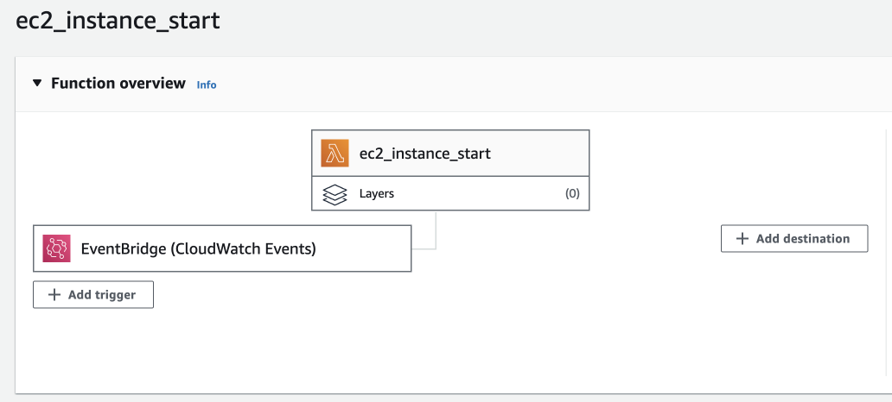
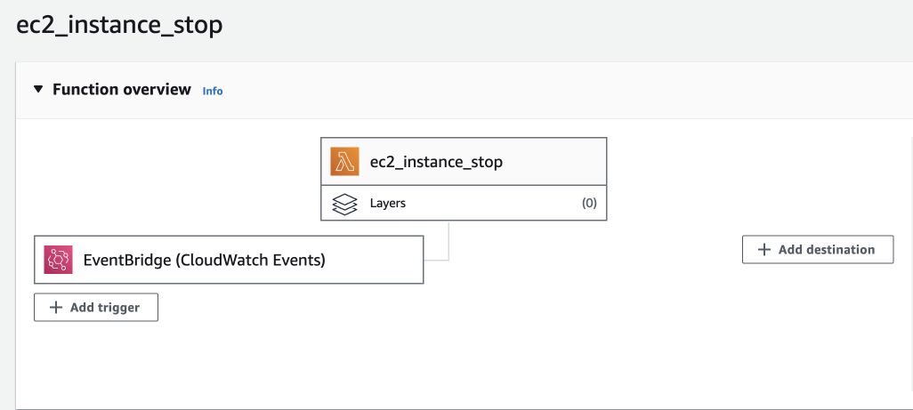

 For now, we need to start/ stop these ec2 on Testing environments

#### 1. Tools
- Amazon EventBridge
- Amazon Lambda
- Amazon CloudWatch
- AWS IAM Role & Policy


#### 2. Details
##### a. IAM Role & Policy
- Policy
```
{
	"Version": "2012-10-17",
	"Statement": [
		{
			"Sid": "VisualEditor0",
			"Effect": "Allow",
			"Action": [
				"ec2:Start*",
				"ec2:Stop*"
			],
			"Resource": "*"
		},
		{
			"Sid": "VisualEditor1",
			"Effect": "Allow",
			"Action": [
				"logs:CreateLogStream",
				"logs:CreateLogGroup",
				"logs:PutLogEvents"
			],
			"Resource": "arn:aws:logs:*:*:*"
		}
	]
}
```
##### b. Amazon EventBridge
 - Schedule start: `00 00 * * ? *` (UTC time)
 - Schedule stop: `00 14 * * ? *` (UTC time)

##### c. Lambda Code
 - Please check more in code scripts

 

 
